# Quick start (pre-alpha)

**English** · [Русский](../ru/quickstart.md)

NetRuleRouter controls **which traffic uses which connection** — by domain,
IP address, or application. It works with connections you already have
(main internet + VPN, two providers, Wi-Fi + Ethernet), and is not a VPN
client, proxy, or anonymity tool.

> **This is pre-alpha.** Emergency blocking (kill switch) and leak
> protection (fail-closed) have not yet passed full testing and may work
> incorrectly — up to a complete loss of network access until the mode is
> disabled. They are available in settings, but enabling them is at your
> own risk.

## Requirements

- Windows 10 or 11, 64-bit
- Administrator rights — once, to install the background service
- Two network connections to route traffic between (for example, main
  internet and VPN). You can also work with one —
  see [«If you have no additional connection»](#if-you-have-no-additional-connection)

## Installation

1. Download the archive from the [releases page](https://github.com/kroxiksut/net-rule-router/releases).
2. Unpack it into any folder — for example, on your Desktop or at the root
   of drive `C:` or `D:`.
3. Run `NetRuleRouter.exe`. At first launch the app will show the
   [end-user license agreement](../legal/eula.en.md) — read and accept
   it to continue.

   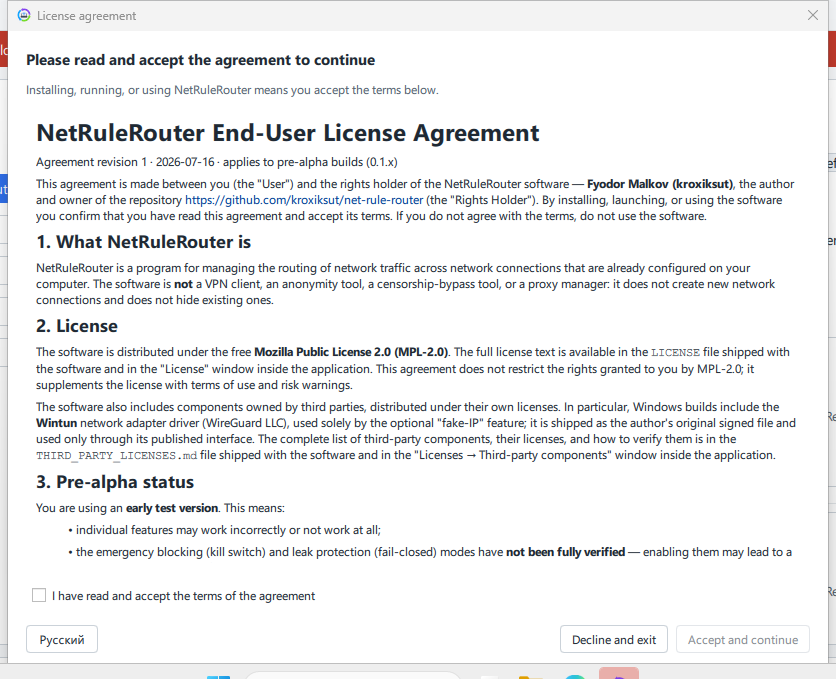

4. Install the background service. The welcome window offers it right
   away — **"Install and start the service"**; confirm the UAC prompt for
   administrator rights. The same actions live in **Settings → Service
   management**, where the service can also be started, stopped, and
   removed.

Without the service, the app runs in limited mode: you can edit rules, but
routing does not apply.

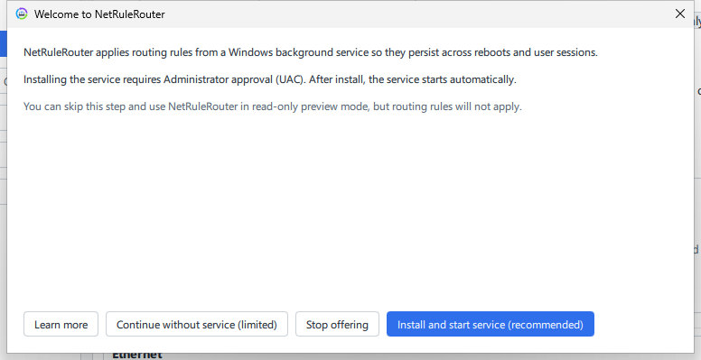

## First setup

1. **Pick a starting rule set.** Right after the service dialog, the
   first-run wizard offers four options: a country preset, a built-in
   demo set, two `.txt` files of your own, or an empty start. Whatever
   you pick lands in the rules for review before anything is applied.

   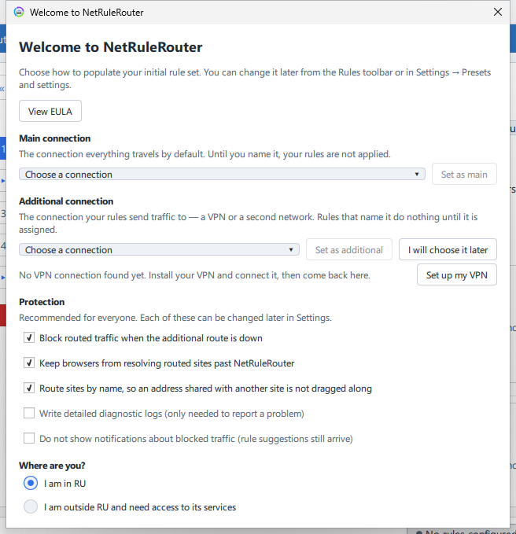

   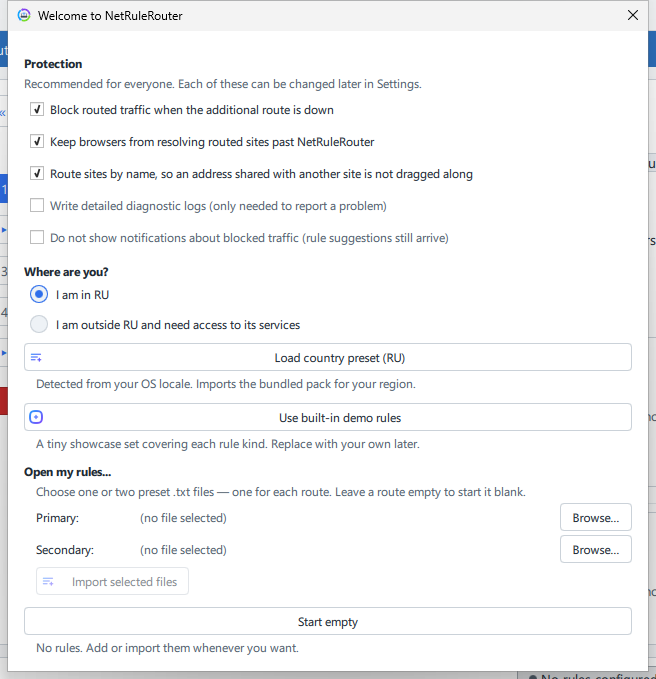

2. **Choose two routes.** On the *Interfaces & routes* screen, specify
   which network adapter is the *main* (primary) one and which is the
   *additional* (secondary, for example VPN). Both can be given custom
   names — they will be visible in the rules.

   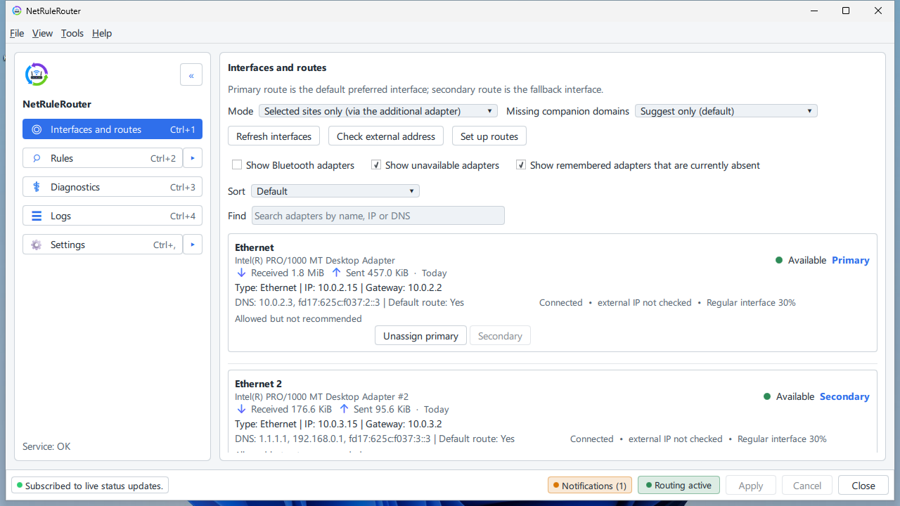

3. **Choose default behavior** — where does traffic that doesn't match any
   rule go: the main or additional route.

   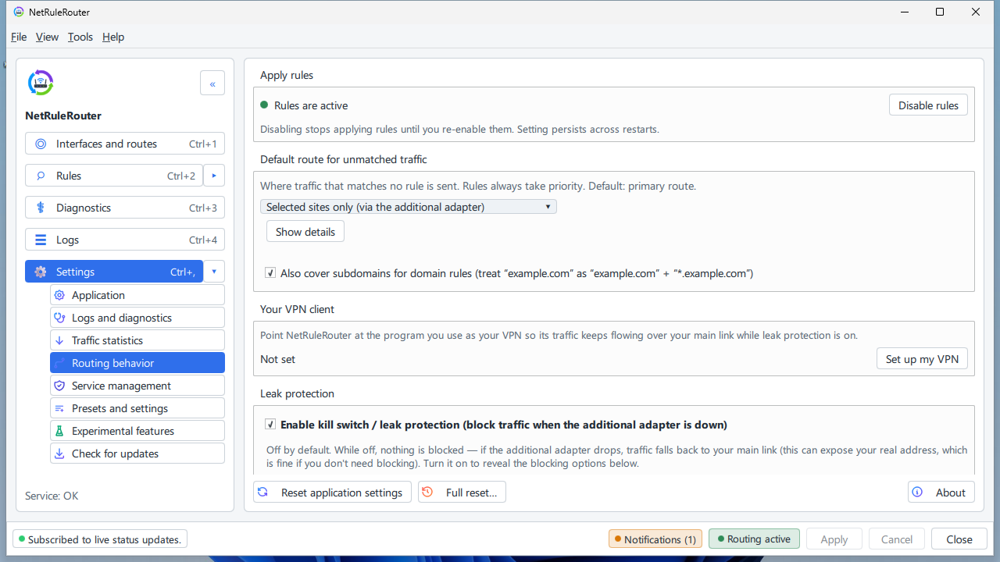

4. **Save the set as your own.** Settings → *Presets & settings* → *My rule
   sets*: point it at a folder of your own, then *"Save current rules as a
   set"* and give it a name. Rule sets left in the application folder are
   replaced by the next update; a set in your own folder survives it, and
   you can keep several — "home", "work" — and switch between them.

   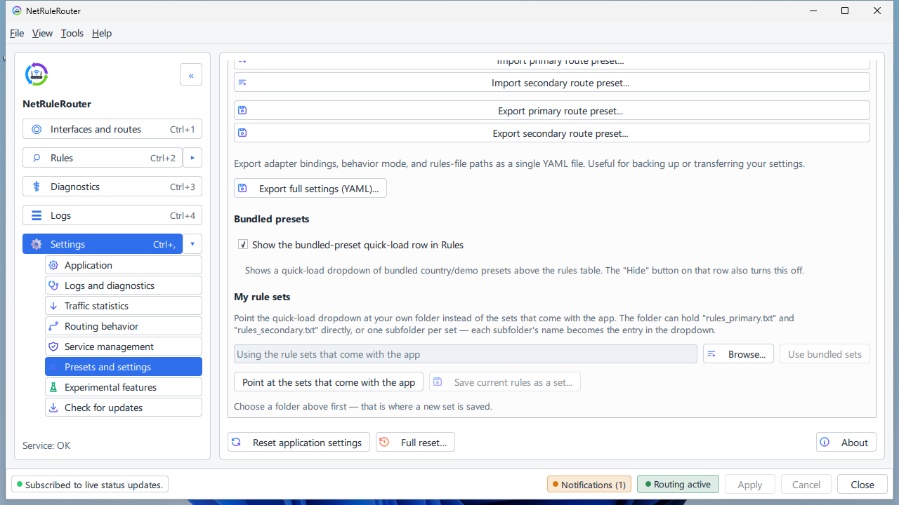

5. **Add your own sites and apply** — see the next section.

## Rules: how it works

A rule says: "this traffic → through that route". Traffic can be described
four ways:

| Type | Example | Matches |
|-----|--------|---------|
| Exact domain | `api.example.com` | only this host |
| Domain with subdomains | `*.example.com` | the domain and all subdomains |
| Domain zone | `.ru` | all domains in the zone |
| Exact IP | `203.0.113.7`, `2001:db8::7` | only that address |
| Application | `chrome.exe` | all traffic from that process |

Rules are applied from specific to general: an exact domain beats
subdomains, subdomains beat zones. A rule can combine address **and**
application — then both conditions must match.

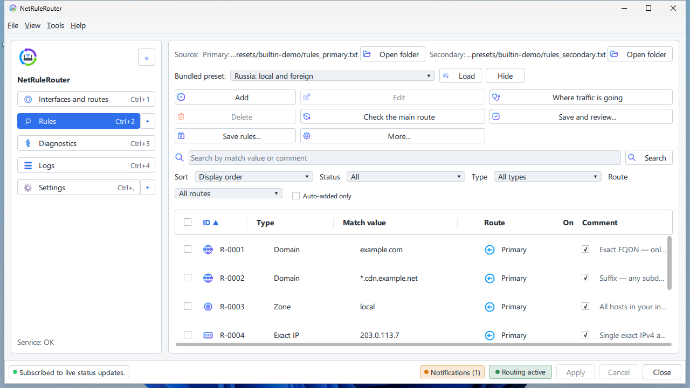

### Add your own sites — a one-time step

The service routes exactly what the rules say and nothing else. Sites that
used to open for you over the VPN keep going out over the main connection
until they appear in the rules of the additional (secondary) route — a
preset ships someone else's list, not yours.

So right after the first setup, go through the sites you actually use over
the VPN and add them yourself, either way round:

- in the **Rules** section of the app — pick the additional route, add the
  domain (`example.com` and `*.example.com` for its subdomains);
- or straight in `rules_secondary.txt` inside your rule-set folder, one
  entry per line, then reload the set in the app.

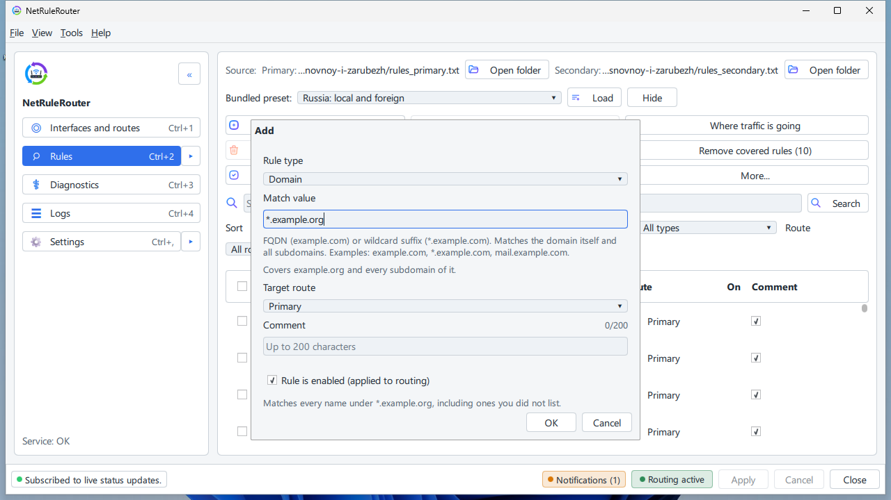

Then press **Apply**: rules only take effect after applying. You do this
once — from then on the list travels with your rule set, including across
reinstalls.

Apply never surprises you: the app first shows what the service is about to
receive — every rule added, changed or removed — and waits for your
confirmation.

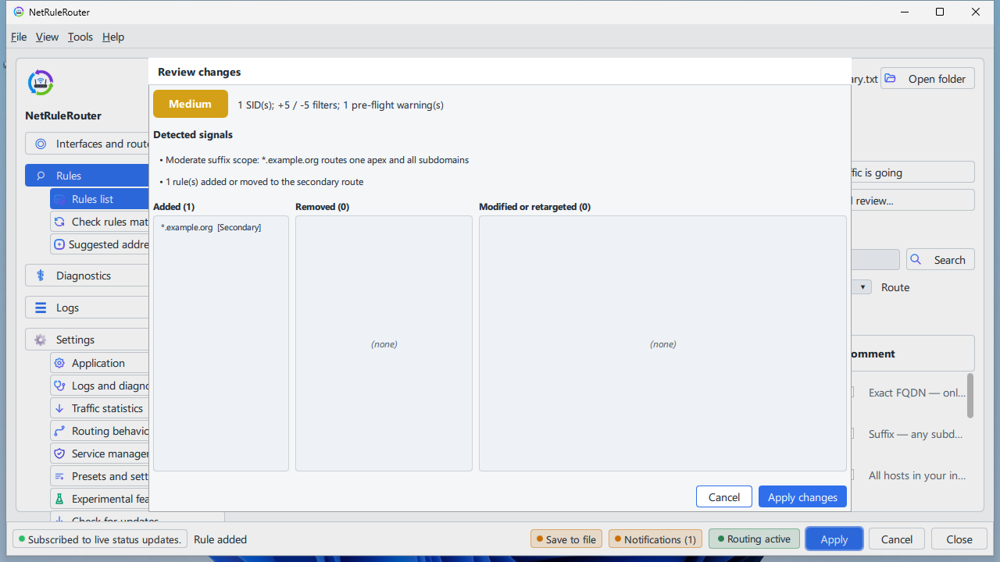

### Application rules need a restart of the program

An application rule names a program to watch: the addresses it contacts are
learned as it connects, and the route follows from the next connection onward.
A program that is **already running** when you add its rule will therefore see
its first attempts fail — installers and updaters in particular often give up
at that point and report that there is no connection.

So: add the rule, press **Apply**, then restart the program. If you also know
the site the program uses, an ordinary domain rule (`*.example.com`) is the
better tool — it takes effect as soon as the name is looked up, with nothing to
learn first.

### Suggestions you are not interrupted about

While you work, the app notices further hosts the sites you route actually
need, and offers to add them. A host that already answers over your main
connection is **not** raised in the tray: it works without the additional
route, and interrupting you about it would be noise.

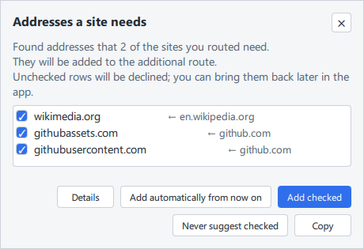

It is still in the suggestions list, marked as reachable on the main
connection. Answering is not the same as serving — some sites answer a
main-connection address with a refusal — so the decision stays yours: open the
list and add it if the site is not actually working for you.

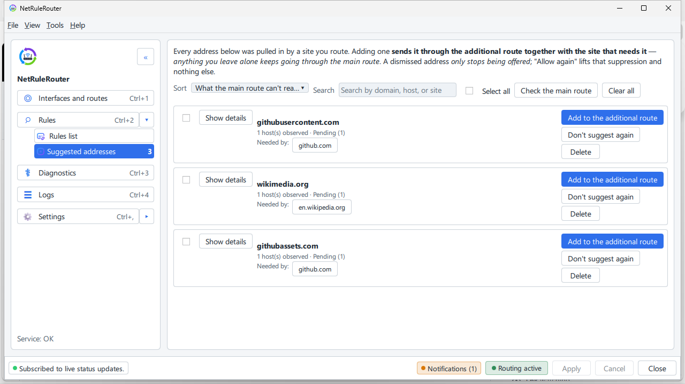

### Overlapping rules

When rules of the two routes cover the same sites — the zone `ru` on one
route and `mail.example.ru` on the other, or `*.example.com` and
`*.api.example.com` — the narrower rule wins: an exact name beats a
wildcard, a wildcard beats a zone, a longer name beats a shorter one.

**Rules → Overlaps** lists every such pair and says which route its sites
take. Press **Correct** to confirm a pair, or send those sites over the other
route. A confirmed pair leaves the list; **Show resolved** brings it back.
The number next to the entry counts the pairs you have not confirmed yet; the
entry is hidden while there are none. A change here is an ordinary edit of
your rules list and takes effect after **Apply**.

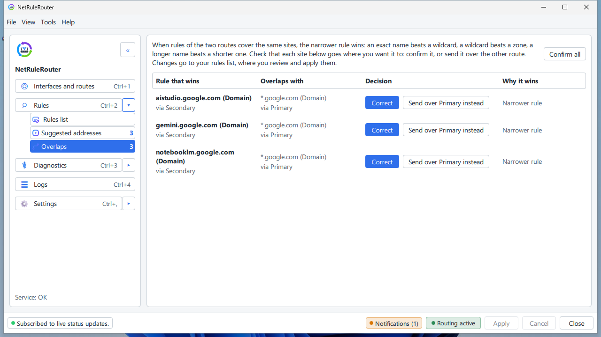

### If you have no additional connection

You may not have a VPN or a second line — then simply **do not assign** an
additional (secondary) route during setup. Rules that direct traffic to the
additional route will be ignored, and all traffic will go the usual way,
through the main channel. This is expected behavior, not an error: the
rules stay in place and will work as soon as you assign an additional
route (for example, install a VPN).

If you want traffic from such rules to be **blocked instead of using the
main channel**, turn on emergency blocking (kill switch) — but read the
warning at the beginning of this document: in pre-alpha that mode is
enabled at your own risk.

If you do use a VPN, tell the app which program it is — its client keeps
working over your main link while leak protection is on, instead of being cut
off with everything else.

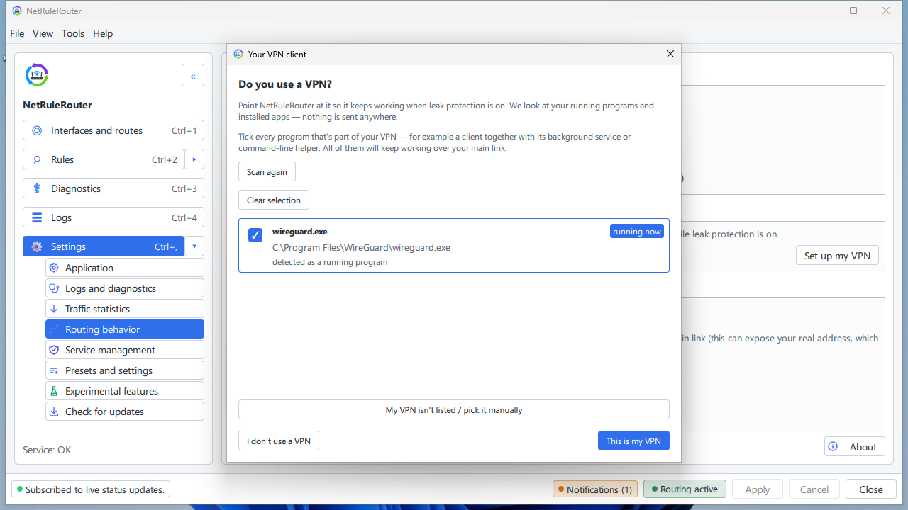

### Ready-made presets

The `presets/` folder contains ready-made rule sets — including
splits like "home traffic / foreign traffic" for several countries. Two
ways to load one: the quick-load row above the rules table (Settings →
*Presets & settings* → *Bundled presets* turns it on and off), or
Settings → *Presets & settings* → *Import preset for the main / additional
route*. Either way the app shows what changes before anything is applied.

Import a set and adapt it to yourself: presets are a starting point, not
the final truth.

## Settings and appearance

Settings → *Application* holds how the app behaves (the tray icon at sign-in,
minimizing to the tray, tray notifications), the theme, accessibility options
and the interface language — Russian or English.

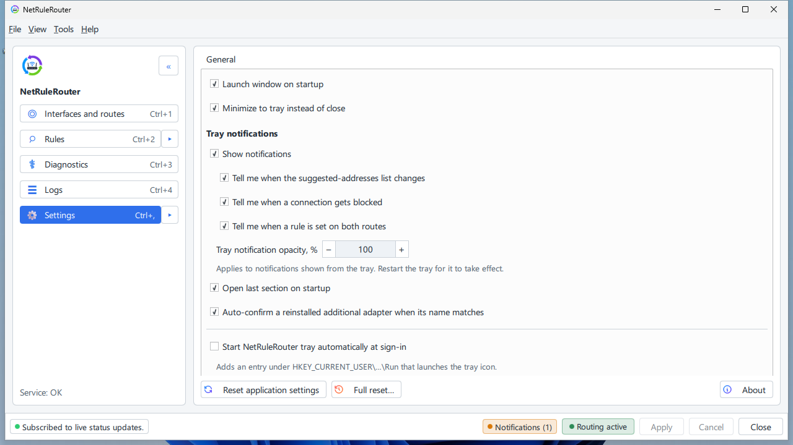

The theme follows the system or can be set to light or dark; for low vision
there is a dedicated high-contrast theme.

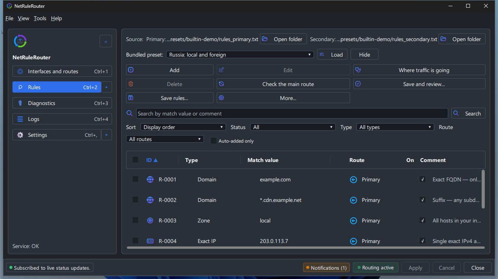

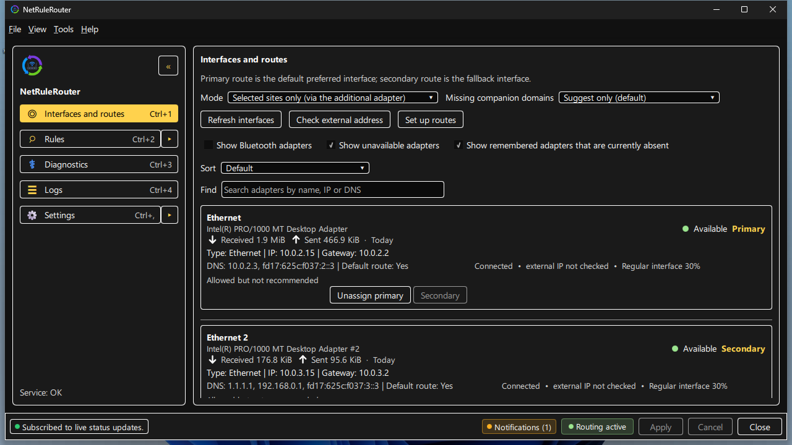

Settings → *Logs and diagnostics* decides how much the service records and how
long it keeps it — the default keeps enough for a bug report without filling
your disk.

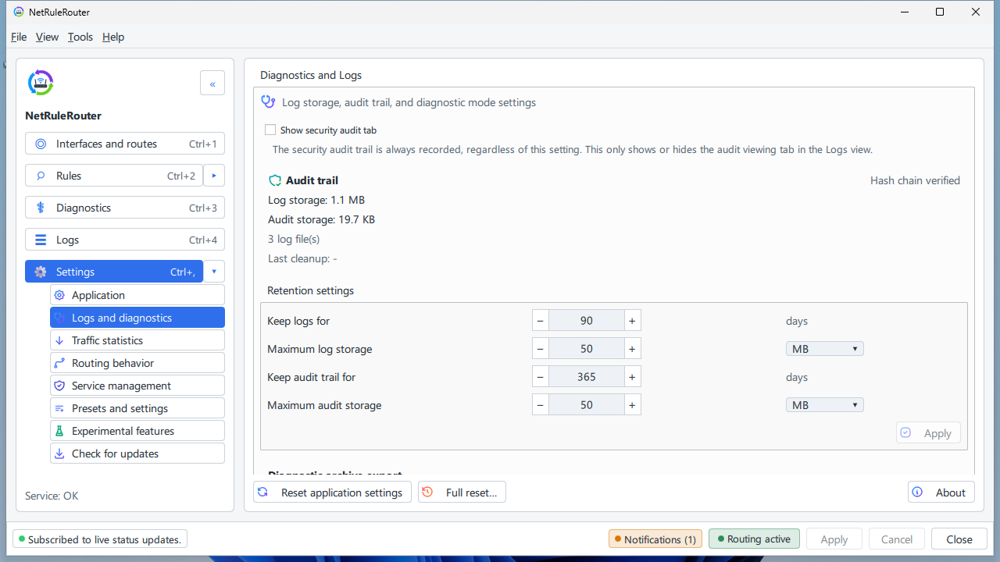

Settings → *Traffic statistics* answers the question a second connection always
raises: how much actually went through it, and how much went the usual way.

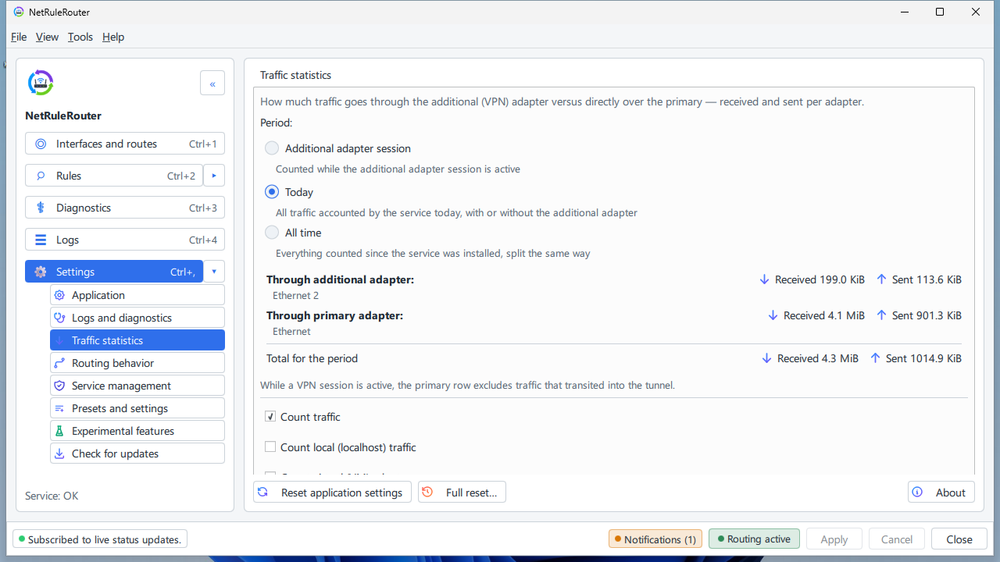

Most of the day you will not have the window open at all. The tray icon says
whether your rules are being applied, and its menu holds the actions you need
most — including turning the rules off for a moment.

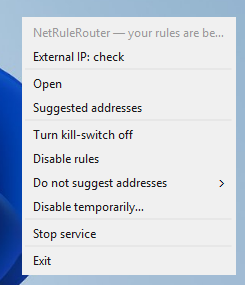

## Check that it works

1. Add a rule for some site to the additional route.
2. Apply the changes.
3. Open that site and verify it sees the additional connection's IP
   address (for example, using an IP detection service).
4. In the "Diagnostics" section you can ask the app *why* a particular
   host went to a particular route — it will show the rule that fired.

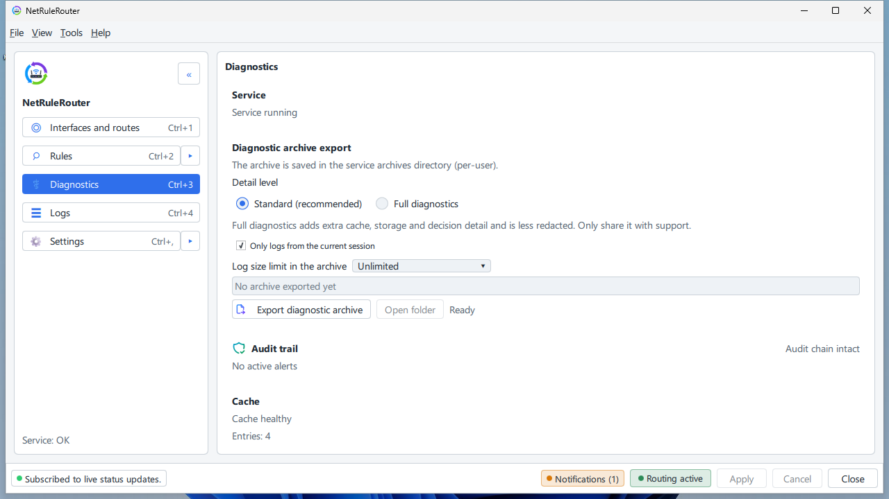

## If something is not working

1. Check that the service is running: **Settings → Service management** —
   the status should be "Running" (from a terminal: `nrr-cli status`).

   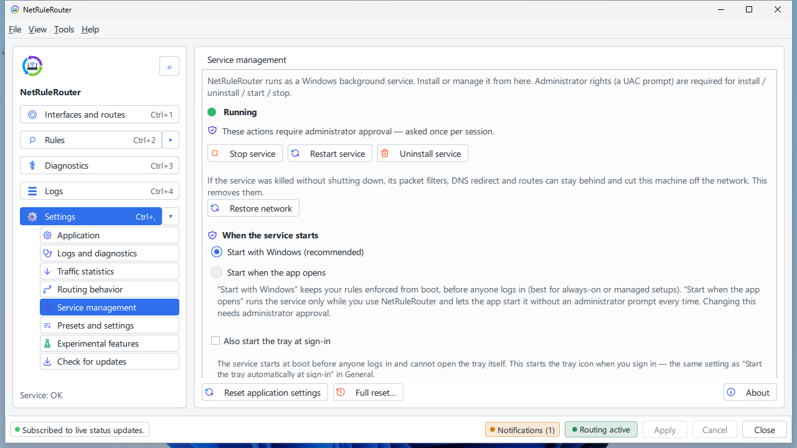

2. Look in the "Diagnostics" section — you can see applied rules and
   errors there. "Logs" lists what the service did, newest first.

   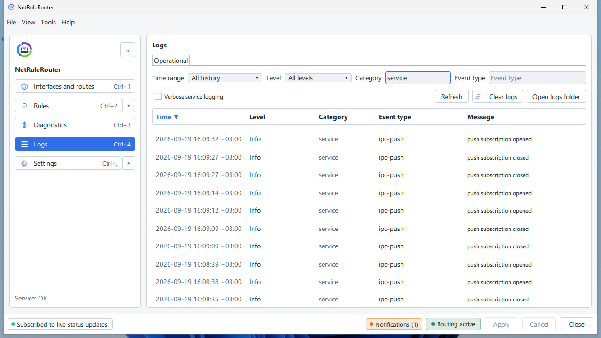

3. Ask the console for a verdict: `nrr-cli diag doctor` checks the service
   and its data from outside the app and reports what it found.
4. That did not help — collect a diagnostic archive ("Diagnostics" section
   → "Diagnostic archive export", or `nrr-cli diag export`) and create an
   [issue](https://github.com/kroxiksut/net-rule-router/issues) with the
   archive attached and a description: what you did, what you expected,
   what happened.

## Lost internet? How to reset everything

The app makes no permanent changes to your system: all routes and blocking
filters it creates are **temporary** — they do not survive a reboot. If
after experimenting with rules (especially with emergency blocking modes)
you lost network access, proceed step by step:

1. **Turn off emergency blocking / leak protection** in the app settings
   and apply the changes.
2. **Stop the service** — Settings → Service management → Stop service.
   When the service stops, it removes its routes and protection, every
   connection returns to the main channel. The same from PowerShell as
   administrator:

   ```powershell
   Stop-Service NetRuleRouter        # or: sc.exe stop NetRuleRouter
   ```

3. **Reboot your computer** — this guarantees a reset: the app's routes
   and filters do not persist between reboots. If the service is set to
   start with Windows and the problem recurs — after reboot stop the
   service with the command above.

To see the current routing table for diagnostics, use
`route print -4` (or `Get-NetRoute -AddressFamily IPv4`).

## Removal

1. Remove the service: **Settings → Service management → Remove service**
   (or from an administrator terminal: `nrr-cli uninstall`; add `--purge`
   to delete the data the service owns as well). When the service is
   removed, it clears the installed routing rules.
2. Close the app and delete the program folder.

---

Русская версия: [docs/ru/quickstart.md](../ru/quickstart.md).
