# Быстрый старт (пре-альфа)

[English](../en/quickstart.md) · **Русский**

NetRuleRouter управляет тем, **какой трафик через какое подключение идёт** —
по домену, IP-адресу или приложению. Он работает с подключениями, которые у
вас *уже есть* (основной интернет + VPN, два провайдера, Wi-Fi + Ethernet),
и не является VPN-клиентом, прокси или средством анонимизации.

> **Это пре-альфа.** Режимы аварийной блокировки (kill switch) и защиты от
> утечек (fail-closed) ещё **не прошли полную проверку и могут работать
> некорректно** — вплоть до полной потери доступа в сеть до отключения режима.
> Они доступны в настройках, но их включение — на ваш страх и риск.

## Требования

- Windows 10 или 11, 64-bit
- Права администратора — один раз, для установки фоновой службы
- Два сетевых подключения, между которыми будет делиться трафик
  (например, основной интернет и VPN). Можно работать и с одним —
  см. [«Если дополнительного подключения нет»](#если-дополнительного-подключения-нет)

## Установка

1. Скачайте архив со [страницы релизов](https://github.com/kroxiksut/net-rule-router/releases).
2. Распакуйте в любую папку — например, на Рабочий стол или в корень
   диска `C:` или `D:`.
3. Запустите `NetRuleRouter.exe`. При первом запуске программа покажет
   [пользовательское соглашение](../legal/eula.ru.md) — прочитайте и
   примите его, чтобы продолжить.

   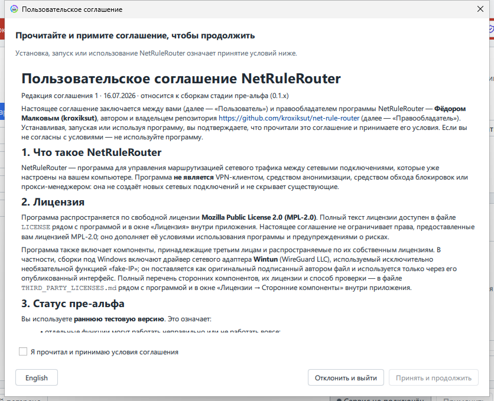

4. Установите фоновую службу. Окно приветствия предлагает это сразу —
   **«Установить и запустить службу»**; подтвердите запрос прав
   администратора (UAC). Те же действия есть в **Настройки → «Управление
   службой»**: там служба запускается, останавливается и удаляется.

Без службы приложение работает в ограниченном режиме: правила можно
редактировать, но маршрутизация не применяется.

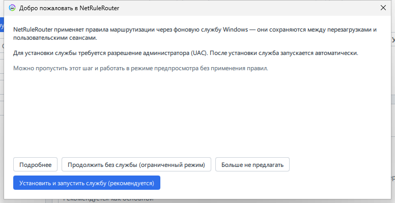

## Первая настройка

1. **Выберите стартовый набор правил.** Сразу после окна про службу
   открывается мастер первого запуска с четырьмя вариантами: страновой
   пресет, встроенный демо-набор, ваши собственные два `.txt`-файла или
   пустой старт. Выбранное попадает в правила на просмотр — до применения.

   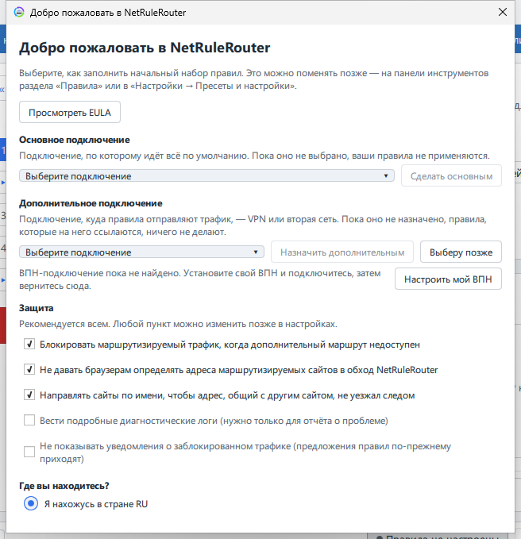

   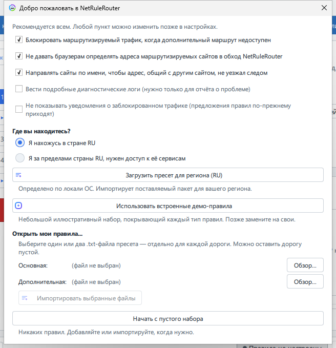

2. **Выберите два маршрута.** На экране *«Интерфейсы и маршруты»* укажите,
   какой сетевой адаптер считается *основным* (primary), а какой —
   *дополнительным* (secondary, например VPN). Обоим можно дать свои
   названия — они будут видны в правилах.

   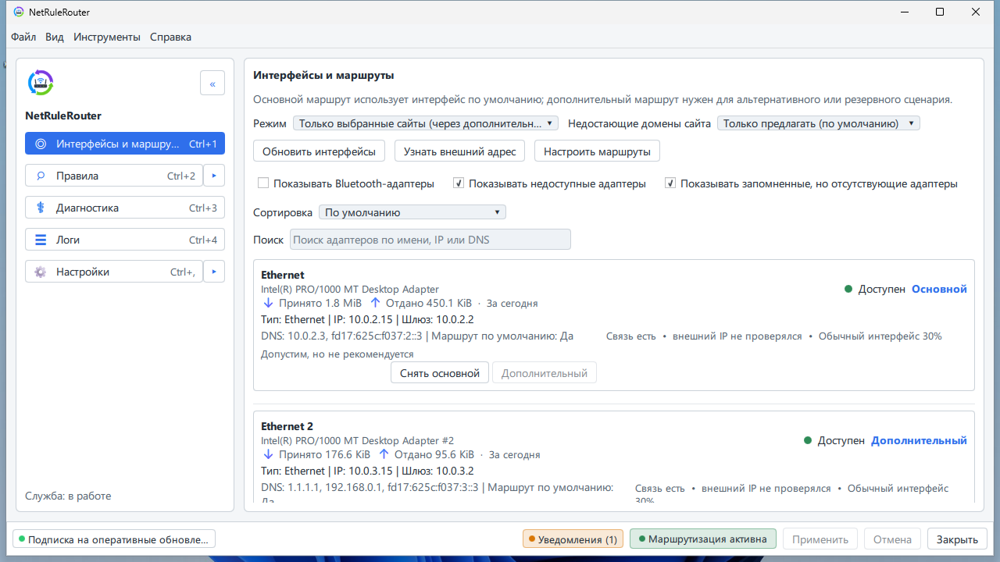

3. **Выберите поведение по умолчанию** — куда идёт трафик, не подпавший ни
   под одно правило: через основной или через дополнительный маршрут.

   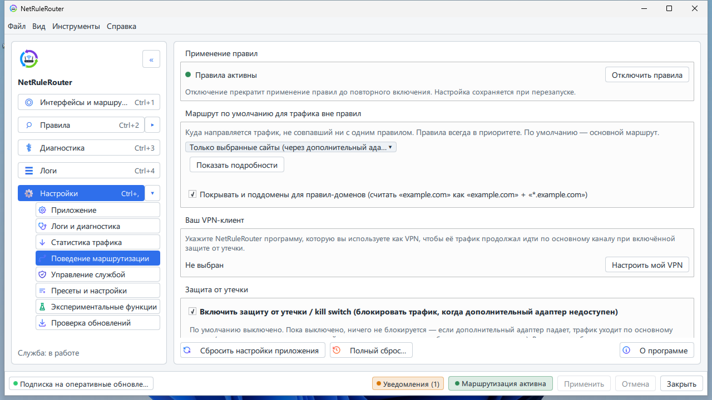

4. **Сохраните набор как свой.** Настройки → *«Пресеты и настройки»* →
   *«Мои наборы правил»*: укажите свою папку, нажмите *«Сохранить текущие
   правила как набор»* и дайте ему имя. Наборы, оставшиеся в папке
   приложения, заменяются при следующем обновлении; набор в вашей папке
   его переживёт, а держать таких наборов можно несколько — «дом»,
   «работа» — и переключаться между ними.

   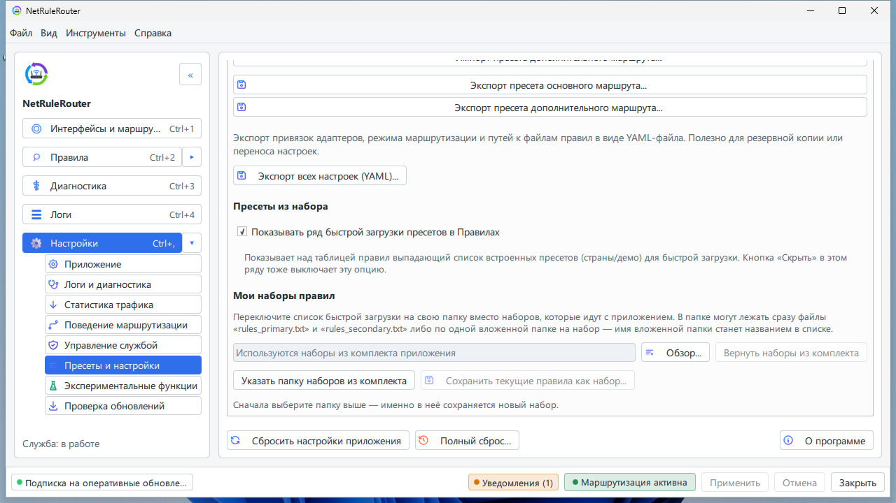

5. **Добавьте свои сайты и примените** — см. следующий раздел.

## Правила: как это работает

Правило говорит: «такой-то трафик → через такой-то маршрут». Трафик можно
описать четырьмя способами:

| Тип | Пример | Что попадает |
|-----|--------|--------------|
| Точный домен | `api.example.com` | только этот хост |
| Домен с поддоменами | `*.example.com` | сам домен и все поддомены |
| Доменная зона | `.ru` | все домены зоны |
| Точный IP | `203.0.113.7`, `2001:db8::7` | только этот адрес |
| Приложение | `chrome.exe` | весь трафик процесса |

Правила применяются от частного к общему: точный домен сильнее поддоменов,
поддомены сильнее зоны. Правило может сочетать адрес **и** приложение — тогда
должны выполниться оба условия.

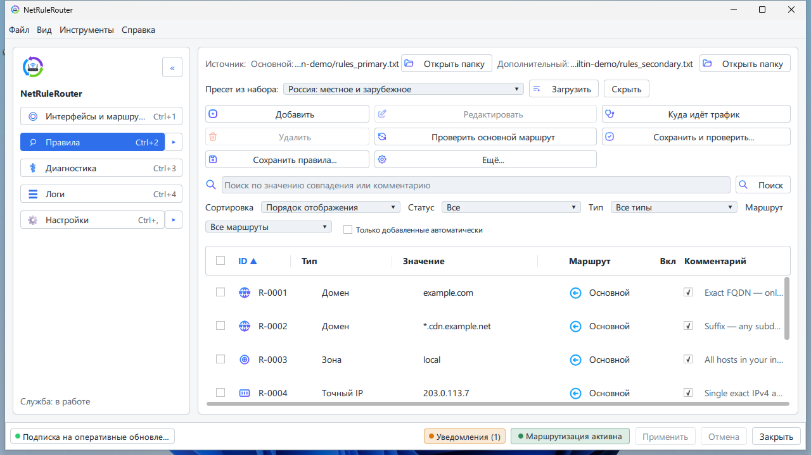

### Добавьте свои сайты — разовый шаг

Служба маршрутизирует ровно то, что написано в правилах, и ничего сверх
того. Сайты, которые раньше открывались у вас через VPN, продолжат ходить
по основному каналу, пока их нет в правилах дополнительного (secondary)
маршрута: в пресете лежит чей-то чужой список, а не ваш.

Поэтому сразу после первой настройки пройдитесь по сайтам, которыми вы
реально пользуетесь через VPN, и добавьте их сами — любым из двух способов:

- в разделе **«Правила»** приложения: выберите дополнительный маршрут и
  добавьте домен (`example.com` и `*.example.com` — для его поддоменов);
- либо прямо в файле `rules_secondary.txt` в вашей папке наборов, по одной
  записи на строку, и затем загрузите набор в приложении.

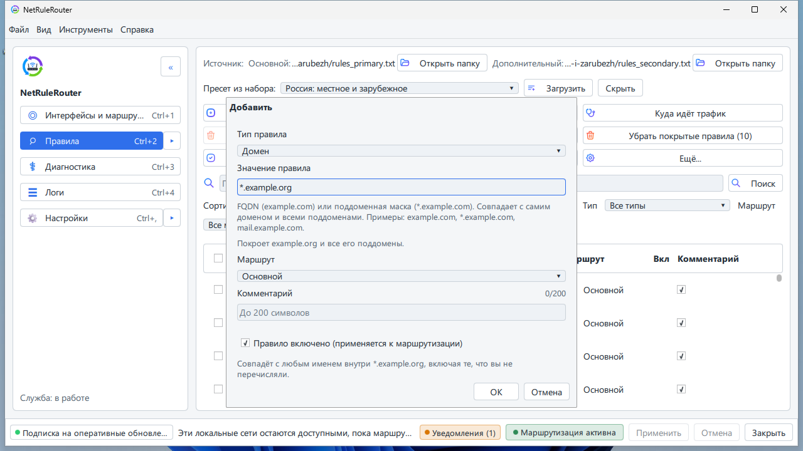

После этого нажмите **«Применить»**: правила вступают в силу только после
применения. Это делается один раз — дальше список живёт вместе с вашим
набором правил и переживает переустановку.

«Применить» не преподносит сюрпризов: программа сначала показывает, что
именно получит служба — каждое добавленное, изменённое и удалённое правило —
и ждёт вашего подтверждения.

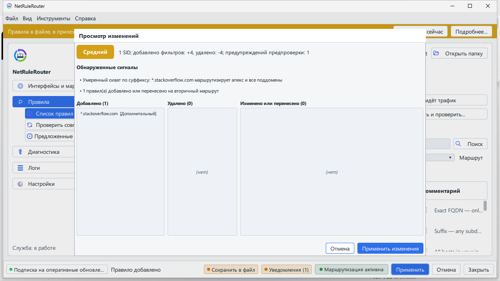

### Правилу для приложения нужен перезапуск программы

Правило для приложения называет программу, за которой следить: адреса, к
которым она обращается, узнаются по ходу её работы, и маршрут действует со
следующего соединения. Поэтому программа, **уже запущенная** в момент, когда вы
добавили правило, первые попытки соединения провалит — установщики и апдейтеры
на этом часто сдаются и сообщают, что связи нет.

Порядок такой: добавьте правило, нажмите **Применить**, затем перезапустите
программу. Если вы знаете сайт, которым программа пользуется, обычное доменное
правило (`*.example.com`) сработает лучше: оно действует с момента, когда имя
запрашивается, и узнавать ничего не нужно.

### Предложения, которыми вас не отвлекают

Пока вы работаете, приложение замечает другие узлы, которые нужны сайтам из
ваших правил, и предлагает их добавить. Узел, который и так отвечает по
основному подключению, в трее **не** всплывает: он работает и без
дополнительного маршрута, и отвлекать вас на него — шум.

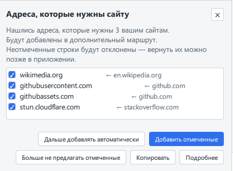

В списке предложений он остаётся, с пометкой «доступен по основному
подключению». Отвечать — не то же самое, что обслуживать: некоторые сайты
отвечают на адрес основного подключения отказом. Поэтому решение остаётся за
вами: откройте список и добавьте узел, если сайт у вас всё-таки не работает.

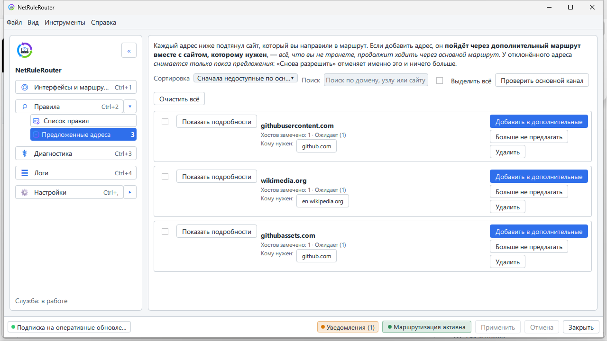

### Перекрывающиеся правила

Когда правила двух маршрутов покрывают одни и те же сайты — зона `ru` на
одном маршруте и `mail.example.ru` на другом, или `*.example.com` и
`*.api.example.com`, — побеждает более узкое правило: точное имя сильнее
маски, маска сильнее зоны, более длинное имя сильнее короткого.

**Правила → Перекрытия** показывает каждую такую пару и маршрут, по которому
идут её сайты. Нажмите **Всё верно**, чтобы подтвердить пару, или направьте
эти сайты через другой маршрут. Подтверждённая пара уходит из списка, галка
**Показать решённые** возвращает её. Число рядом с пунктом — сколько пар ещё не
подтверждено; пока перекрытий нет, пункт скрыт. Изменение здесь — обычная
правка списка правил, она вступает в силу после **Применить**.

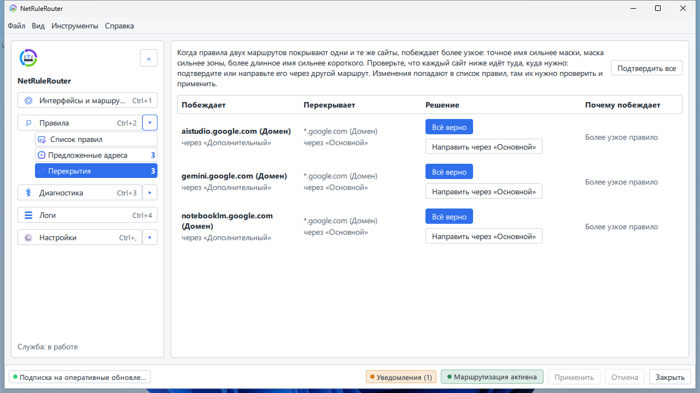

### Если дополнительного подключения нет

VPN или второго канала может и не быть — тогда дополнительный (secondary)
маршрут при настройке просто **не назначайте**. Правила, направляющие трафик
в дополнительный маршрут, в этом случае игнорируются, и весь трафик идёт как
обычно, через основной канал. Это ожидаемое поведение, а не ошибка: правила
остаются на месте и заработают, как только вы назначите дополнительный
маршрут (например, установите VPN).

Если же вы хотите, чтобы трафик из таких правил **не уходил в основной
канал, а блокировался**, включите аварийную блокировку (kill switch) — но
учтите предупреждение в начале этого документа: в пре-альфе этот режим
включается на ваш страх и риск.

Если VPN у вас всё-таки есть, укажите программе, какая это программа: её
клиент продолжит работать по основному каналу при включённой защите от утечек,
а не окажется отрезанным вместе со всем остальным.

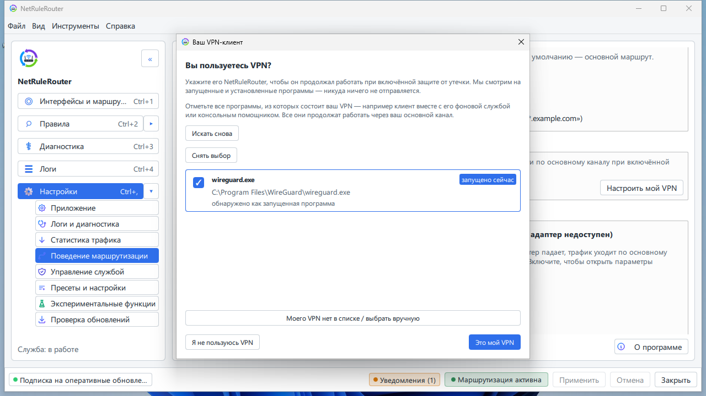

### Готовые пресеты

В папке `presets/` лежат готовые наборы правил — в том числе разбивки
«домашний трафик / зарубежный» для ряда стран. Загрузить набор можно двумя
способами: рядом быстрой загрузки над таблицей правил (включается и
выключается в Настройки → *«Пресеты и настройки»* → *«Пресеты из набора»*)
или через Настройки → *«Пресеты и настройки»* → *«Импорт пресета основного /
дополнительного маршрута»*. В обоих случаях приложение сначала покажет, что
изменится, и только потом применит.

Импортируйте набор и адаптируйте под себя: пресеты — это стартовая точка,
а не истина в последней инстанции.

## Настройки и оформление

В разделе Настройки → *«Приложение»* собраны поведение программы (значок в
трее при входе в систему, сворачивание в трей, уведомления в трее), тема,
специальные возможности и язык интерфейса — русский или английский.

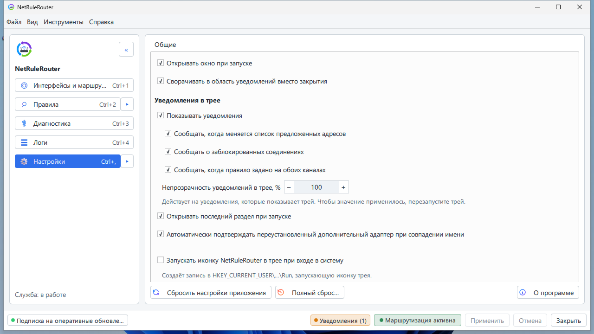

Тема следует системной или задаётся явно — светлая или тёмная; для
слабовидящих есть отдельная тема высокой контрастности.

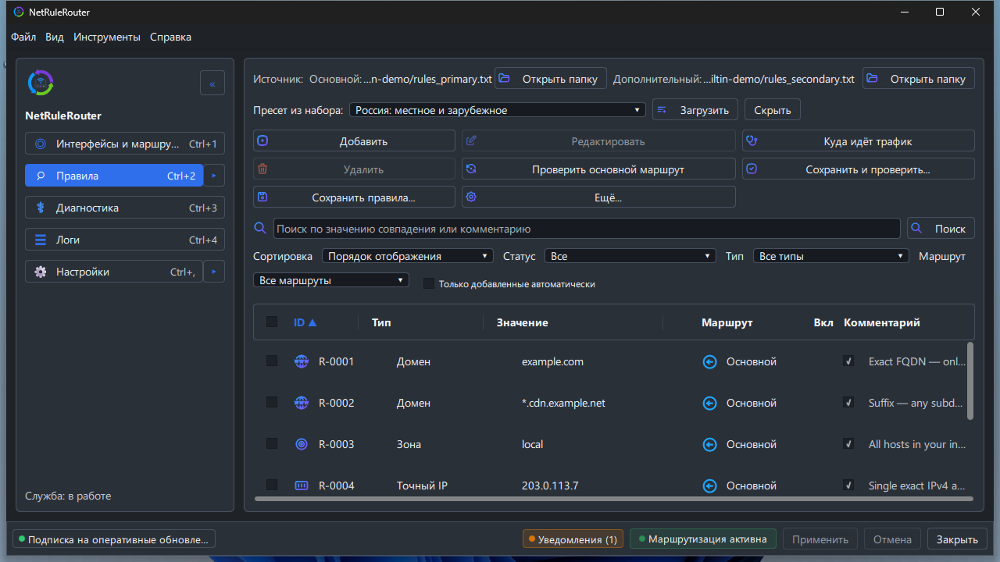

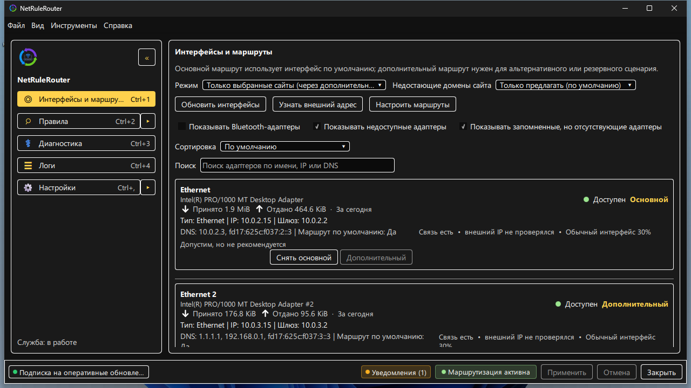

Настройки → *«Логи и диагностика»* определяют, сколько служба записывает и как
долго хранит: по умолчанию этого хватает на отчёт об ошибке и не забивает диск.

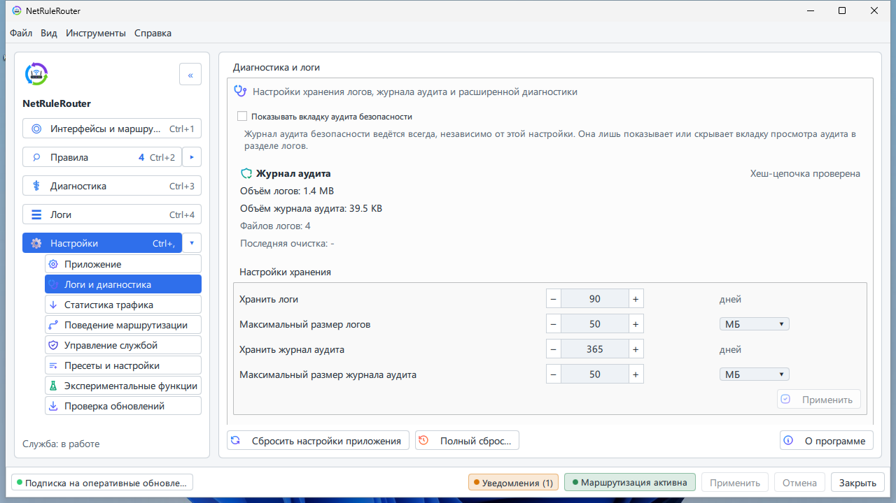

Настройки → *«Статистика трафика»* отвечают на вопрос, который всегда возникает
со вторым подключением: сколько в действительности ушло через него, а сколько —
обычным путём.

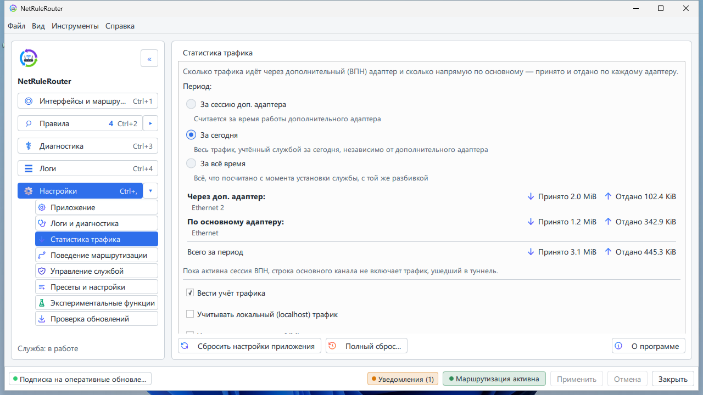

Большую часть времени окно у вас открыто не будет. Значок в трее говорит,
применяются ли ваши правила, а его меню держит самые нужные действия — включая
возможность на время выключить правила.

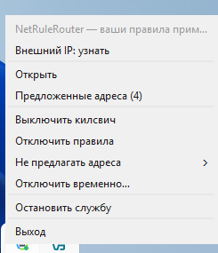

## Проверить, что работает

1. Добавьте правило для какого-нибудь сайта на дополнительный маршрут.
2. Примените изменения.
3. Откройте этот сайт и убедитесь, что он видит IP-адрес дополнительного
   подключения (например, через сервис определения IP).
4. В разделе «Диагностика» можно спросить у программы, *почему* конкретный
   хост ушёл в конкретный маршрут — она покажет сработавшее правило.

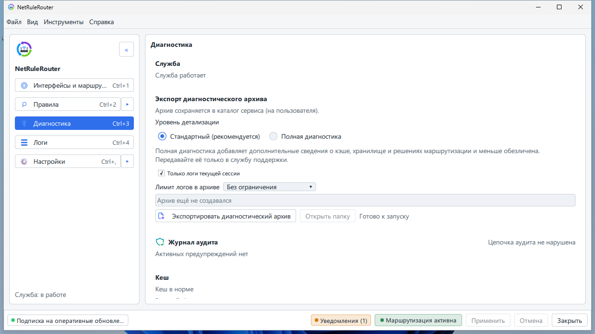

## Если что-то не работает

1. Проверьте, что служба запущена: **Настройки → «Управление службой»** —
   статус должен быть «Работает» (из терминала: `nrr-cli status`).

   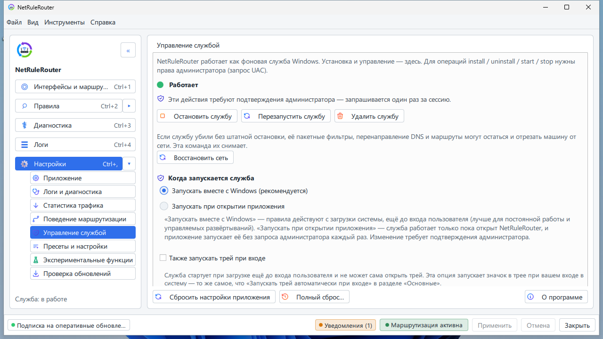

2. Загляните в раздел «Диагностика» — там видно применённые правила и ошибки.
   В разделе «Логи» записано, что делала служба, свежее сверху.

   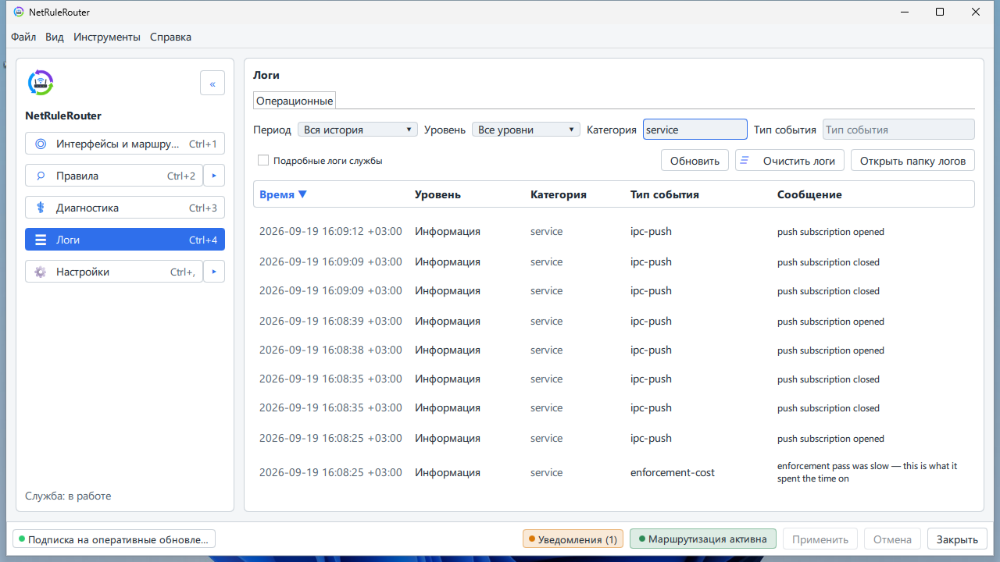

3. Спросите вердикт у консоли: `nrr-cli diag doctor` проверяет службу и её
   данные снаружи приложения и сообщает, что нашёл.
4. Не помогло — соберите диагностический архив: раздел «Диагностика» →
   «Экспорт диагностического архива» (или `nrr-cli diag export`) — и создайте
   [issue](https://github.com/kroxiksut/net-rule-router/issues) с приложенным
   архивом и описанием: что делали, что ожидали, что произошло.

## Пропал интернет? Как всё сбросить

Программа не вносит необратимых изменений в систему: все маршруты и
блокирующие фильтры, которые она создаёт, **временные** — они не переживают
перезагрузку. Если после экспериментов с правилами (особенно с режимами
аварийной блокировки) пропал доступ в сеть, действуйте по нарастающей:

1. **Выключите аварийную блокировку / защиту от утечки** в настройках
   приложения и примените изменения.
2. **Остановите службу** — Настройки → «Управление службой» → «Остановить
   службу». При остановке служба снимает свои маршруты и защиту, каждое
   соединение возвращается на основной канал. То же из PowerShell от имени
   администратора:

   ```powershell
   Stop-Service NetRuleRouter        # или: sc.exe stop NetRuleRouter
   ```

3. **Перезагрузите компьютер** — это гарантированный сброс: маршруты и
   фильтры программы не сохраняются между перезагрузками. Если служба
   настроена запускаться вместе с Windows и проблема воспроизводится —
   после перезагрузки остановите службу командой выше.

Посмотреть текущую таблицу маршрутов для диагностики можно командой
`route print -4` (или `Get-NetRoute -AddressFamily IPv4`).

## Удаление

1. Удалите службу: **Настройки → «Управление службой» → «Удалить службу»**
   (или из терминала администратора: `nrr-cli uninstall`; добавьте `--purge`,
   чтобы удалить и данные, которыми владеет служба). При удалении служба
   снимает установленные правила маршрутизации.
2. Закройте приложение и удалите папку программы.

---

Английская версия: [docs/en/quickstart.md](../en/quickstart.md).
